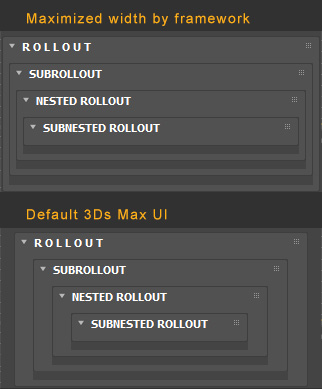

# WIDTH OF SUBROLLLOUTS  


## WIDTHS OF SUBROLLOUTS AND SLOTS ARE MAXIMIZED AS IS POSSIBLE  


  

---  


# HEIGHT OF SUBROLLOUTS  

## Currently unsupported by framework  

In 3ds Max MAXScript, you don't define the height of a `subRollout` control directly within its own definition. Instead, the height is determined by the **container** (the rollout that holds it).  

The `subRollout` acts like a window or a frame. If the rollouts you add to it are taller than the subRollout's defined height, a scrollbar will automatically appear.  

---  

### 1. Basic Syntax  
When you define the `subRollout` in your UI layout, you provide the height as a parameter:  

```maxscript  
subRollout <name> [width] [height] [align:<string>]  
```  

### 2. Practical Example  
In this script, the main rollout defines a subRollout window that is **200 pixels high**. We then add a nested rollout that is **400 pixels high**, which forces the subRollout to scroll.  

```maxscript  
(  
	-- 1. Define the rollout that will go INSIDE the subRollout  
	rollout childRollout "Child Content" (  
		button btn_1 "Top Button"  
		-- Adding space to make it tall  
		label lbl_spacer "" height:350  
		button btn_2 "Bottom Button"  
	)  

	-- 2. Define the main container rollout  
	rollout mainRollout "SubRollout Explorer" (  
		-- Here is where you define the height!  
		subRollout theSubRollout "Sub Window" height:200  
	)  

	-- 3. Create the dialog and add the child to the subRollout  
	createDialog mainRollout 300 250  
	AddSubRollout mainRollout.theSubRollout childRollout  
)  
```  

### 3. Dynamic Height Resizing  
If you want the subRollout height to change while the script is running (for example, to snap to the size of its contents or react to a window resize), you can access the `.height` property of the control.  

**Common property adjustments:**  
* `mainRollout.theSubRollout.height = 300`: Changes the height of the "viewing window."  
* `mainRollout.theSubRollout.width = 250`: Changes the width.  

---  

### Key Tips for SubRollouts  
* **Automatic Scrollbars:** You cannot manually turn scrollbars on or off; they appear automatically if `childRollout.height > subRollout.height`.  
* **The "Double Rollout" Rule:** Remember that the `subRollout` is just a UI element. You still have to define a standard `rollout` separately and use `AddSubRollout` to "plug" it in.  
* **Alignment:** If you don't specify a height, the subRollout might collapse or default to a very small size, making it look like your UI disappeared. Always define an initial height.  

Do you need the subRollout to automatically resize itself to match the total height of all the rollouts you've added to it?  