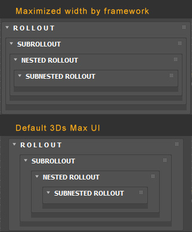

# OOP wrapper for maxscript dialogs

• **Painless coding maxscript dialogs**

• **Integrates many basic functionalities of dialog out of the box**

• **Generates rollouts and controls based on file structure**

## Basic dialog features out of box

- Save \ load UI state to ini file
  - **Dialog size, position and dock state**
  - Open \ close state of rollouts
  - **Values and states of controls**

## Rollouts feautures
- Order of subrollouts is saved to ini file
- Press CTRL to open single rollout and close others

## Generates rollouts and controls based on file structure

	Directory → ROLLOUT
 
        .mcr file → GROUP OF CONTROLS
	 
            macroscript → CONTROL

## Widths of rollouts are maiximized in [SubolloutsCreator](Lib/RolloutCreator/SubolloutsCreator)

KNOWING ISSUES:
	Contentloader has bug with loading file into menu if fiule is named: "Menus.mcr"

